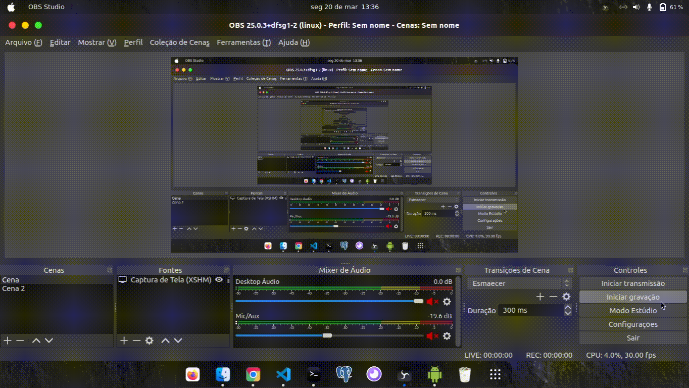

# App Mail

Aplicação Front-End, desenvolvida em React Native, que utliza as requisições que foram criadas da Send-Email API. O projeto tem como finalidade comprir o desafio proposto da Mentoria e mostrar uma interface intuitiva utilizando recursos do React Native.

## Configuração para o desenvolvimento

Para baixar e instalar o projeto, siga os passos:

1. `git clone <link do repositorio>`
2. `cd <pastaDoProjeto>`
3. `npm install ou yarn install`
4. `npm start ou yarn start`

## Rodando a Aplicação

